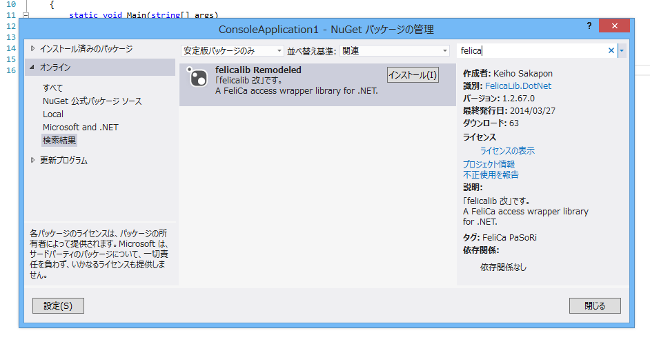

## felicalib 改

felicalib 改 (felicalib Remodeled) is a FeliCa access wrapper library for .NET, forked from [tmurakam/felicalib](https://github.com/tmurakam/felicalib).

### Setup
felicalib 改は、[NuGet Gallery](http://www.nuget.org/packages/FelicaLib.DotNet/) に登録されています。  
felicalib 改を利用するには、次の方法で NuGet パッケージをインストールします。

(方法 1) Visual Studio の [パッケージ マネージャー コンソール] で、次のコマンドを実行します。

```
Install-Package FelicaLib.DotNet
```

(方法 2) Visual Studio でプロジェクトを右クリックして、[Nuget パッケージの管理] で「felicalib Remodeled」を検索してインストールします。「felica」と入力すれば見つかります。



### Testing environment
* [PaSoRi RC-S380](http://www.sony.co.jp/Products/felica/consumer/products/RC-S380.html)
* Windows 8
* .NET Framework 3.5, 4.5

### Release notes
* **v1.1.0** NuGet に登録しました (この時点でソースコードは変更していません)。
* **v1.1.6** アンマネージ リソースの扱いを改善し、安定性を向上させました。
* **v1.2.26** クラスを再設計し、安定性を向上させました。
* **v1.2.48** ユーティリティ メソッドを追加するなど、API を改善しました。

### Future plans
* **v1.3** 一定間隔の自動ポーリング。
* **v1.4** WebSocket サーバーによるホスト。
